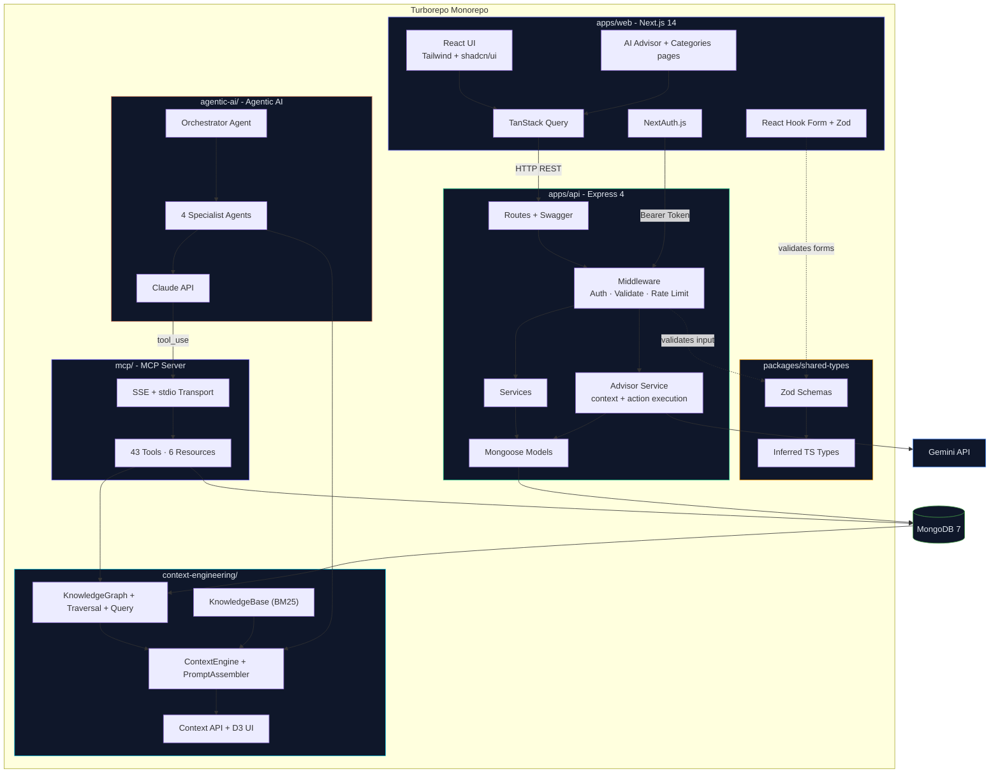
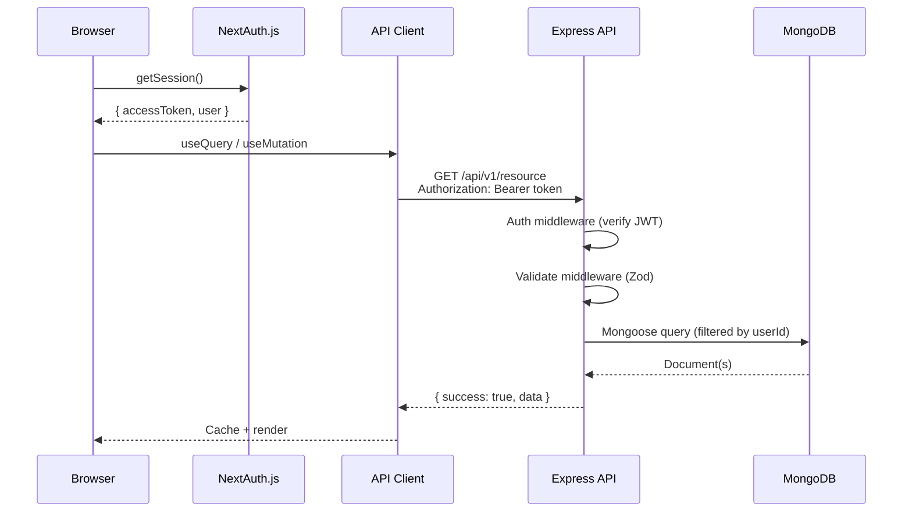
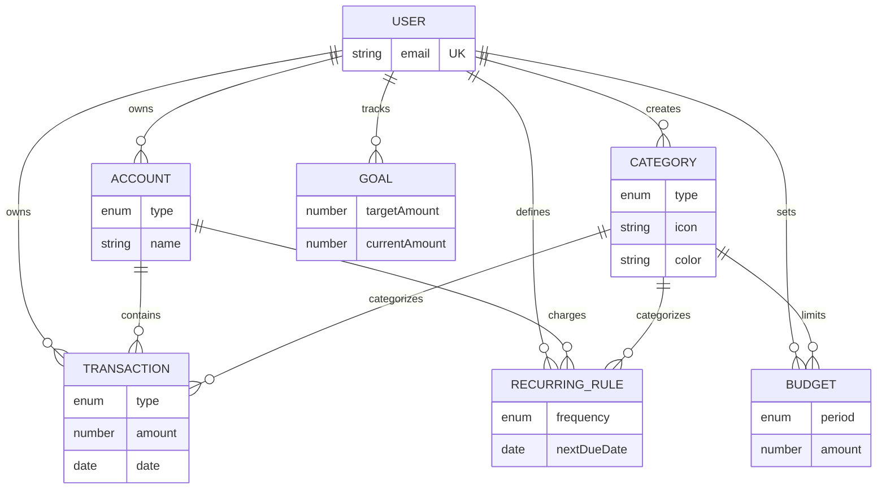
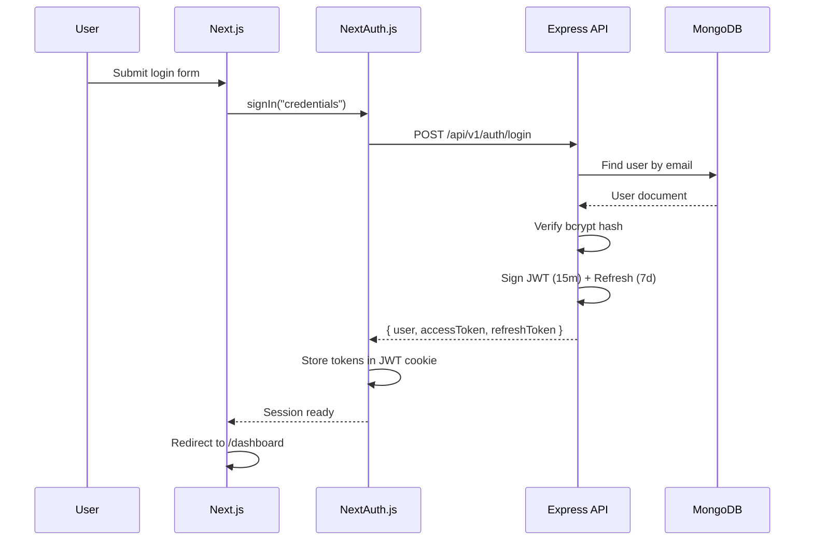
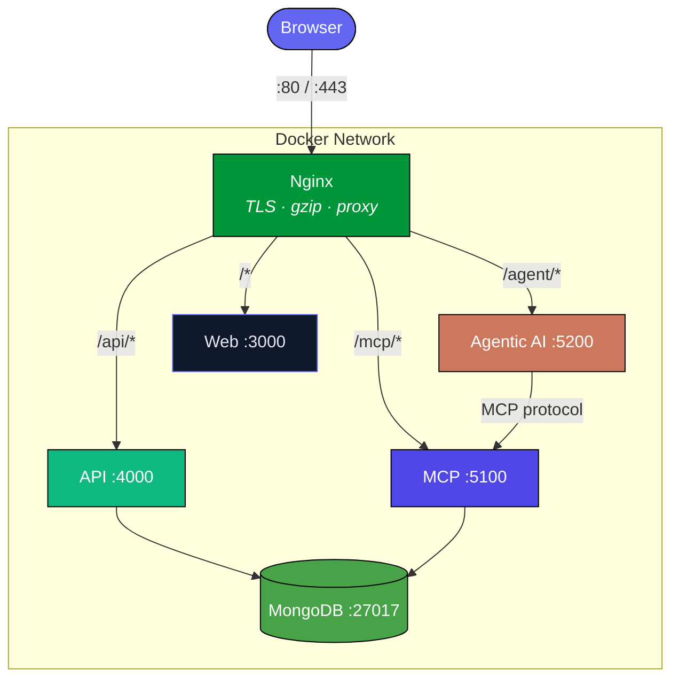
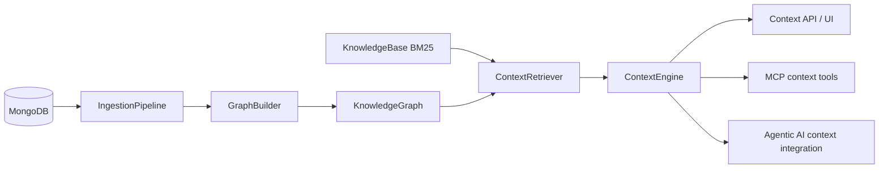
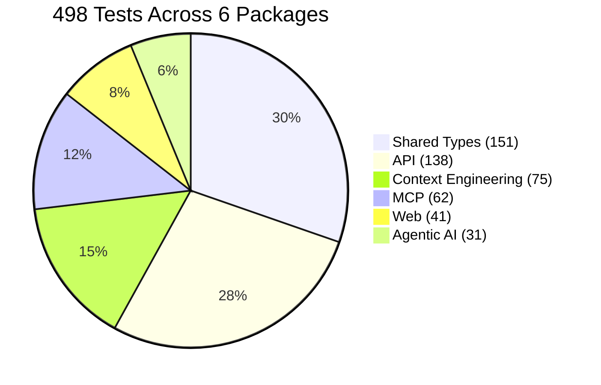
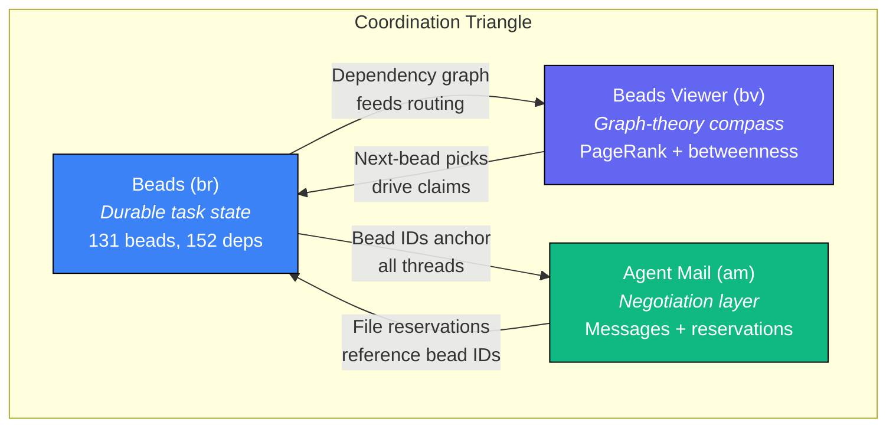
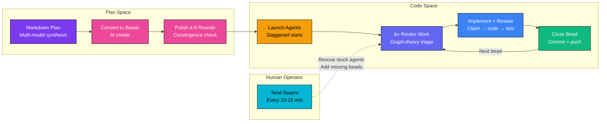

# FinSight - Personal Finance Manager

[](https://nodejs.org/)
[](https://www.typescriptlang.org/)
[](https://npmjs.com/)
[](https://turbo.build/)
[](https://prettier.io/)
[](https://nextjs.org/)
[](https://react.dev/)
[](https://tailwindcss.com/)
[](https://www.radix-ui.com/)
[](https://tanstack.com/query)
[](https://react-hook-form.com/)
[](https://next-auth.js.org/)
[](https://recharts.org/)
[](https://lucide.dev/)
[](https://expressjs.com/)
[](https://zod.dev/)
[](https://jwt.io/)
[](https://swagger.io/)
[](https://www.mongodb.com/)
[](https://www.mongodb.com/)
[](https://mongoosejs.com/)
[](https://vitest.dev/)
[](https://docs.docker.com/compose/)
[](https://podman.io/)
[](https://nginx.org/)
[](https://kubernetes.io/)
[](https://helm.sh/)
[](https://kustomize.io/)
[](https://www.terraform.io/)
[](https://coralogix.com/)
[](https://aws.amazon.com/)
[](https://aws.amazon.com/fargate/)
[](https://aws.amazon.com/cloudformation/)
[](https://aws.amazon.com/documentdb/)
[](https://azure.microsoft.com/)
[](https://azure.microsoft.com/products/container-apps)
[](https://learn.microsoft.com/azure/azure-resource-manager/bicep/)
[](https://azure.microsoft.com/products/cosmos-db)
[](https://cloud.google.com/)
[](https://cloud.google.com/run)
[](https://cloud.google.com/build)
[](https://www.oracle.com/cloud/)
[](https://www.oracle.com/cloud/cloud-native/container-engine-kubernetes/)
[](https://www.jenkins.io/)
[](https://github.com/)
[](https://about.gitlab.com/stages-devops-lifecycle/continuous-integration/)
[](https://argo-cd.readthedocs.io/)
[](https://argo-rollouts.readthedocs.io/)
[](https://modelcontextprotocol.io/)
[](https://anthropic.com/)
[](https://ai.google.dev/gemini)
[](https://getpino.io/)
[](https://esbuild.github.io/)

A full-stack personal finance application built with a **Turborepo monorepo**, featuring an **Express REST API**, a **Next.js 14** frontend, and **shared Zod schemas** for end-to-end type safety. Track accounts, transactions, categories, budgets, goals, recurring bills, and analytics with a responsive interface, CSV import, and polished dashboard workflows.

FinSight also features an **MCP Server** exposing 43 financial tools and 6 resources, a **Context Engineering** service/package for graph-based financial context assembly, and an **Agentic AI** service with 4 specialized Claude-powered financial advisors. The project includes comprehensive testing with **Vitest** and an interactive **Swagger UI** for API exploration. It is containerized with **Docker/Podman** and ready for production deployment with **Nginx**, **Kubernetes**, and cloud platforms like **AWS**, **Azure**, and **GCP**.

---

## Table of Contents

- [High-Level Architecture](#high-level-architecture)
- [Features](#features)
- [User Interface](#user-interface)
- [Project Structure](#project-structure)
- [Getting Started](#getting-started)
  - [Prerequisites](#prerequisites)
  - [1. Clone and install](#1-clone-and-install)
  - [2. Configure environment](#2-configure-environment)
  - [3. Start MongoDB](#3-start-mongodb)
  - [4. Seed default data](#4-seed-default-data)
  - [5. Start development](#5-start-development)
- [Scripts](#scripts)
- [Testing](#testing)
- [API Documentation](#api-documentation)
  - [Endpoints](#endpoints)
  - [Request Lifecycle](#request-lifecycle)
- [Database Schema](#database-schema)
- [Authentication Flow](#authentication-flow)
- [Docker Deployment](#docker-deployment)
  - [Development](#development)
  - [Production](#production)
- [MCP Server](#mcp-server)
- [Context Engineering](#context-engineering)
- [Agentic AI](#agentic-ai)
- [Technical Docs](#technical-docs)
- [Cloud Deployment & Infrastructure](#cloud-deployment--infrastructure)
  - [Hardened Production Docker](#hardened-production-docker)
  - [Kubernetes](#kubernetes)
  - [Helm Chart](#helm-chart)
  - [Terraform Modules](#terraform-modules)
  - [Cloud Providers](#cloud-providers)
  - [Production Nginx](#production-nginx)
  - [Utility Scripts](#utility-scripts)
  - [GitHub Actions CI/CD](#github-actions)
- [Test Coverage](#test-coverage)
- [Agentic Coding Flywheel](#agentic-coding-flywheel)
- [Tech Stack](#tech-stack)
- [License](#license)
- [Creator](#creator)

---

## High-Level Architecture



---

## Features

- **Multi-account tracking** - checking, savings, credit cards, cash, investments
- **Transaction management** - CRUD, filtering, sorting, text search, CSV import with duplicate detection
- **Categories workspace** - dedicated category page with search, filters, usage insights, safe delete warnings, and reusable create/edit dialogs
- **Budget alerts** - per-category budgets with configurable thresholds and spending progress
- **Financial goals** - target amounts, deadlines, fund contributions, completion tracking
- **Recurring rules** - daily, weekly, biweekly, monthly, yearly schedules with upcoming bills view
- **Analytics dashboard** - 8 charts: spending by category, income vs. expense, cash flow, savings rate, net worth, cumulative savings, category breakdown over time, spending by day of week
- **7 dashboard widgets** - net worth, monthly snapshot, recent transactions, budget health, spending donut, upcoming bills, goal progress
- **Appearance settings** - theme mode plus saved reduced-motion and high-contrast preferences
- **Responsive** - mobile sidebar, adaptive layouts, touch-friendly
- **Type-safe contracts** - Zod schemas shared between frontend and backend
- **Interactive API docs** - Swagger UI at `/api/docs`
- **In-app AI Advisor** - Gemini-backed chat grounded on live accounts, transactions, categories, budgets, goals, recurring rules, and real frontend workflow knowledge so it can explain exactly what to do in the app
- **MCP Server** - Model Context Protocol server exposing 43 tools and 6 resources for AI agent consumption
- **Context Engineering service** - graph-based financial context retrieval, BM25 knowledge search, token-budgeted context windows, and a D3 graph UI
- **4 specialist AI agents** - financial advisor, anomaly detector, budget optimizer, and forecaster, orchestrated by an intent classifier

> [!NOTE]
> The frontend is deployed on Vercel at: **[https://finsightfinancial.vercel.app/](https://finsightfinancial.vercel.app/).** You can register a new account or use the following demo credentials to explore the app:
> ```
> Email: demo@finsight.app
> Password: Demo1234!
> ```
> Or, create your own account to test the registration flow and see how the app works with an empty dataset.

> [!TIP]
> The backend is also fully deployed live, accessible at: [https://finsight-backend-api.vercel.app/](https://finsight-backend-api.vercel.app/). You can explore the API documentation at [https://finsight-backend-api.vercel.app/api/docs](https://finsight-backend-api.vercel.app/api/docs) and use the demo credentials above to authenticate and test the endpoints.

---

## User Interface

### 1. Landing Page

<p align="center">
    
</p>

### 2. Dashboard

<p align="center">
    
</p>

### 3. Transactions

<p align="center">
    
</p>

### 4. Budgets

<p align="center">
    
</p>

### 5. Goals

<p align="center">
    
</p>

### 6. Accounts

<p align="center">
    
</p>

### 7. Recurring

<p align="center">
    
</p>

### 8. Analytics

<p align="center">
    
</p>

### 9. Categories

<p align="center">
    
</p>

### 10. AI Advisor

<p align="center">
    
</p>

### 11. Settings

<p align="center">
    
</p>

---

## Project Structure

```
finsight/
├── apps/
│   ├── api/                    # Express REST API
│   │   ├── src/
│   │   │   ├── config/         # Database, env validation, Swagger
│   │   │   ├── controllers/    # Route handlers
│   │   │   ├── middleware/     # Auth, CORS, validation, error handling, rate limiting
│   │   │   ├── models/         # Mongoose schemas (7 models)
│   │   │   ├── routes/         # Express routers with Swagger JSDoc
│   │   │   ├── seeds/          # Default categories + demo data
│   │   │   ├── services/       # Business logic layer
│   │   │   ├── utils/          # ApiError, async handler, pagination
│   │   │   └── __tests__/      # Vitest + mongodb-memory-server
│   │   └── package.json
│   │
│   └── web/                    # Next.js 14 frontend
│       ├── src/
│       │   ├── app/            # App Router pages
│       │   │   ├── (auth)/     # Login, Register
│       │   │   ├── (dashboard)/ # All authenticated pages
│       │   │   ├── (legal)/    # Terms, Privacy
│       │   │   └── api/auth/   # NextAuth route handler
│       │   ├── components/
│       │   │   ├── analytics/  # 8 chart components (Recharts)
│       │   │   ├── advisor/    # AI Advisor chat, suggestions, action cards
│       │   │   ├── budgets/    # Budget cards and forms
│       │   │   ├── categories/ # Category cards, sections, dialogs
│       │   │   ├── dashboard/  # 7 dashboard widgets
│       │   │   ├── goals/      # Goal cards and forms
│       │   │   ├── layout/     # Sidebar, topnav, mobile nav, search
│       │   │   ├── settings/   # Appearance settings and related panels
│       │   │   ├── shared/     # Pickers, currency display, empty state
│       │   │   ├── transactions/ # Table, forms, CSV wizard, filters
│       │   │   └── ui/         # shadcn/ui primitives (20+ components)
│       │   ├── hooks/          # TanStack Query hooks per entity
│       │   ├── lib/            # Auth config, API client, utils, constants
│       │   ├── providers/      # Query, Auth, Theme, UI preference providers
│       │   └── __tests__/      # Vitest + jsdom
│       └── package.json
│
├── packages/
│   └── shared-types/           # Zod schemas + inferred TypeScript types
│       ├── src/
│       │   ├── schemas/        # 8 schema files, including advisor contracts
│       │   ├── types/          # Inferred TS types + API wrappers
│       │   └── __tests__/      # Schema validation tests
│       └── package.json
│
├── mcp/                       # MCP Server (Model Context Protocol)
│   ├── src/
│   │   ├── config/            # Zod-validated env config
│   │   ├── models/            # Mongoose models (mirrors apps/api)
│   │   ├── tools/             # 35 MCP tools (7 modules)
│   │   ├── resources/         # 4 MCP resources
│   │   ├── transport/         # SSE + stdio transports
│   │   ├── auth/              # JWT token resolver
│   │   └── __tests__/         # 61 tests
│   └── package.json
│
├── agentic-ai/                # Agentic AI Service (Claude-powered)
│   ├── src/
│   │   ├── agents/            # 4 specialist agents + orchestrator
│   │   ├── prompts/           # System prompts (markdown)
│   │   ├── mcp/               # MCP client + tool adapter
│   │   ├── conversation/      # Per-user conversation state
│   │   ├── middleware/        # Auth + rate limiting
│   │   ├── routes/            # REST API endpoints
│   │   └── __tests__/         # 31 tests
│   └── package.json
│
├── context-engineering/       # Context engineering service/package
│   ├── src/
│   │   ├── context/           # ContextEngine + PromptAssembler
│   │   ├── graph/             # KnowledgeGraph, Traversal, Query, Builder
│   │   ├── ingestion/         # MongoDB ingestion + data mapping
│   │   ├── knowledge-base/    # Financial rules + BM25 retrieval
│   │   ├── ui/                # D3 graph dashboard routes + static UI
│   │   └── __tests__/         # Graph, KB, traversal, context tests
│   └── package.json
│
├── nginx/                     # Production reverse proxy config
├── helm/                      # Helm chart (alternative to Kustomize)
│   └── finsight/            # Umbrella chart with per-env values files
├── k8s/                       # Kubernetes manifests (Kustomize overlays)
│   ├── base/                  # Base resources (deployments, services, ingress, etc.)
│   └── overlays/              # dev, staging, production overrides
├── terraform/                 # Terraform modules and environments
│   ├── modules/               # Reusable modules (networking, compute, db, etc.)
│   └── environments/          # dev, staging, production compositions
├── aws/                       # AWS deployment (ECS, CloudFormation, scripts)
├── azure/                     # Azure deployment (Bicep, Container Apps, scripts)
├── gcp/                       # GCP deployment (Cloud Run, Terraform, Cloud Build)
├── oci/                       # OCI deployment (OKE, Terraform, scripts)
├── scripts/                   # Utility scripts (secrets, health check, build)
├── docker-compose.yml            # Development: MongoDB + API + Web (hot-reload)
├── docker-compose.prod.yml       # Production: multi-stage Dockerfiles + Nginx
├── docker-compose.production.yml # Production: hardened Dockerfile.prod + health checks
├── turbo.json                  # Turborepo pipeline configuration
├── .prettierrc                 # Prettier + Tailwind plugin config
└── package.json                # Root workspace config
```

---

## Getting Started

### Prerequisites

- **Node.js** >= 18.0.0
- **npm** >= 10.0.0
- **MongoDB** 7+ (local or Docker)

### 1. Clone and install

```bash
git clone https://github.com/hoangsonww/FinSight-Finance-Tracker.git
cd FinSight-Finance-Tracker
npm install
```

### 2. Configure environment

```bash
cp .env.example .env
```

Edit `.env` with your values:

```env
# Database
MONGODB_URI=mongodb://localhost:27017/finsight

# Auth - generate with: openssl rand -base64 32
JWT_SECRET=your-jwt-secret-min-32-chars
JWT_REFRESH_SECRET=your-refresh-secret-min-32-chars
NEXTAUTH_SECRET=your-nextauth-secret-min-32-chars
NEXTAUTH_URL=http://localhost:3000

# API
API_PORT=4000
API_URL=http://localhost:4000
NEXT_PUBLIC_API_URL=http://localhost:4000/api/v1
GOOGLE_AI_API_KEY=your-google-ai-api-key
GEMINI_MODEL=gemini-2.5-flash
GEMINI_MODEL_ALLOWLIST=
GEMINI_ALLOW_PRO_MODELS=false

# MCP Server
MCP_PORT=5100
MCP_TRANSPORT=sse

# Agentic AI
AGENT_PORT=5200
MCP_SERVER_URL=http://localhost:5100
ANTHROPIC_API_KEY=your-anthropic-api-key

# Optional: Google OAuth
GOOGLE_CLIENT_ID=
GOOGLE_CLIENT_SECRET=
```

### 3. Start MongoDB

**Option A - Docker/Podman:**
```bash
docker compose up mongodb -d
# or, with Podman:
podman-compose -f podman-compose.yml up mongodb -d
```

**Option B - Local install:**
```bash
mongod --dbpath /data/db
```

### 4. Seed default data

```bash
npm run db:seed          # Default categories only
npm run db:seed -- demo  # Full demo dataset
```

Or, if you are running the in-memory MongoDB version, run this command **AFTER starting the backend server**: 

```bash
# On Mac/Linux:
curl -X POST http://localhost:4000/api/v1/dev/seed       # adjust the endpoint as needed

# On Windows:
curl.exe -X POST http://localhost:4000/api/v1/dev/seed   # adjust the endpoint as needed
```

> [!IMPORTANT]
> If you use the in-memory MongoDB version, all data in the DB will be lost after server restart.

### 5. Start development

```bash
npm run dev
```

This starts all services in parallel via Turborepo:
- **Web** → http://localhost:3000
- **API** → http://localhost:4000
- **Swagger** → http://localhost:4000/api/docs
- **MCP** → http://localhost:5100
- **Agentic AI** → http://localhost:5200
- **Context Engineering** → http://localhost:5300
- **Context Engineering UI** → http://localhost:5300/ui

---

## Scripts

| Command | Description |
|---------|-------------|
| `npm run dev` | Start all apps in development mode |
| `npm run build` | Build all packages |
| `npm run test` | Run all test suites across 6 packages |
| `npm run lint` | Type-check all packages |
| `npm run format` | Format all files with Prettier |
| `npm run format:check` | Check formatting without writing |
| `npm run db:seed` | Seed default categories |
| `npm run clean` | Remove build artifacts and caches |
| `npx turbo test --filter=@finsight/mcp` | Run MCP server tests (62 tests) |
| `npx turbo test --filter=@finsight/agentic-ai` | Run agentic AI tests (31 tests) |
| `npx turbo test --filter=@finsight/context-engineering` | Run context-engineering tests |
| `npx turbo build --filter=@finsight/mcp` | Build MCP server |
| `npx turbo build --filter=@finsight/agentic-ai` | Build agentic AI service |
| `npx turbo build --filter=@finsight/context-engineering` | Build context-engineering package |

---

## Testing

The project has **498 tests** across all packages:

| Package | Tests | Framework | Environment |
|---------|-------|-----------|-------------|
| `apps/api` | 138 | Vitest + mongodb-memory-server | Node |
| `apps/web` | 41 | Vitest | jsdom |
| `packages/shared-types` | 151 | Vitest | Node |
| `mcp` | 62 | Vitest + mongodb-memory-server | Node |
| `agentic-ai` | 31 | Vitest | Node |
| `context-engineering` | 75 | Vitest | Node |

```bash
# Run all tests
npm run test

# Run tests for a specific package
npx turbo test --filter=@finsight/api
npx turbo test --filter=@finsight/web
npx turbo test --filter=@finsight/shared-types
npx turbo test --filter=@finsight/context-engineering
```

**API tests** use an in-memory MongoDB instance - no external database required. They cover all services, middleware, utility classes, and validation logic.

**Shared-types tests** validate every Zod schema against valid inputs, invalid inputs, edge cases, enum boundaries, and optional field behavior.

**Web tests** cover utility functions: currency formatting, date formatting, class merging, initials extraction, percentage calculations.

---

## API Documentation

Interactive Swagger UI is available at **http://localhost:4000/api/docs** when the API is running.

**Base URL:** `/api/v1`

<p align="center">
    
</p>

### Endpoints

| Group | Endpoints | Auth |
|-------|-----------|------|
| Auth | `POST /auth/register`, `/login`, `/refresh`, `GET/PATCH/DELETE /auth/me` | Public (register, login, refresh) |
| Accounts | `GET/POST /accounts`, `GET/PATCH/DELETE /accounts/:id` | Bearer |
| Transactions | `GET/POST /transactions`, `GET/PATCH/DELETE /transactions/:id`, `POST /import`, `GET /search` | Bearer |
| Categories | `GET/POST /categories`, `PATCH/DELETE /categories/:id` | Bearer |
| Budgets | `GET/POST /budgets`, `PATCH/DELETE /budgets/:id`, `GET /summary` | Bearer |
| Goals | `GET/POST /goals`, `PATCH/DELETE /goals/:id`, `POST /goals/:id/add-funds` | Bearer |
| Recurring | `GET/POST /recurring`, `PATCH/DELETE /recurring/:id`, `GET /upcoming` | Bearer |
| Analytics | `GET /spending-by-category`, `/income-vs-expense`, `/monthly-summary`, `/trends`, `/net-worth`, `/spending-by-day-of-week`, `/category-monthly-breakdown` | Bearer |
| Advisor | `POST /advisor/chat` | Bearer |

**Error response shape:**

```json
{
  "success": false,
  "error": {
    "code": "VALIDATION_ERROR",
    "message": "Invalid input",
    "details": { "email": ["Invalid email format"] }
  }
}
```

### Request Lifecycle



### Example CSV File for Transaction Import

We also provide a CSV import endpoint for transactions. Refer to the [test-transactions.csv](test-transactions.csv) file for the expected format. You can also use it directly on the UI import wizard to test the feature.

---

## Database Schema



---

## Authentication Flow



---

## Docker Deployment

FinSight is fully containerized and includes compose files for both development and production environments. The production setup uses multi-stage builds for optimized images and includes an Nginx reverse proxy configuration. Both Docker and Podman are supported with dedicated compose files and Containerfiles.

Additionally, the project includes Kubernetes manifests and Helm charts for orchestration in cloud environments, as well as Terraform modules for infrastructure provisioning across AWS, Azure, GCP, and Oracle Cloud.

### Development

**Docker:**
```bash
docker compose up
```

**Podman:**
```bash
podman-compose -f podman-compose.yml up
```

Starts MongoDB, API, Web, MCP, and Agentic AI with hot-reload and volume mounts.

### Production

**Docker** — two production compose files are available:

```bash
# Standard production (multi-stage Dockerfiles, Nginx reverse proxy)
docker compose -f docker-compose.prod.yml up -d

# Hardened production (Dockerfile.prod with dumb-init, health checks, resource limits)
docker compose -f docker-compose.production.yml up -d
```

**Podman:**

```bash
podman-compose -f podman-compose.prod.yml up -d
```



---

## MCP Server

The MCP (Model Context Protocol) server exposes FinSight's financial data as **43 tools** and **6 resources** for consumption by AI agents and LLM-powered applications. It supports both **SSE** (Server-Sent Events) and **stdio** transports.

- **Port:** 5100
- **Tools:** 43 tools across 8 modules (accounts, transactions, budgets, goals, categories, recurring, analytics, context)
- **Resources:** 6 resources, including context-engineering-backed knowledge graph and financial knowledge resources
- **Auth:** JWT token resolution - the same tokens used by the REST API

For full details on tool definitions, resource URIs, transport configuration, and integration examples, see **[MCP.md](MCP.md)**.

---

## Context Engineering

The `@finsight/context-engineering` package adds a dedicated context layer between raw finance data and AI behavior.

- **Port:** 5300
- **Core primitives:** `KnowledgeGraph`, `GraphTraversal`, `GraphQueryEngine`, `KnowledgeBase`, `ContextRetriever`, `ContextEngine`
- **Data model:** typed nodes/edges across accounts, transactions, budgets, goals, categories, recurring payments, merchants, insights, tags, and time periods
- **Retrieval:** intent-aware graph retrieval + BM25 knowledge search + token-budget fitting
- **UI:** D3 knowledge graph dashboard at `/ui`



For package-level endpoints, architecture, and module details, see **[context-engineering/README.md](context-engineering/README.md)**.

---

## Agentic AI

The Agentic AI service provides a separate conversational financial advisor powered by **Claude Sonnet 4**. It is distinct from the in-app `/advisor` page, which is served by the main API and uses Gemini with direct access to the user's live finance context.

- **Port:** 5200
- **Agents:** Financial advisor, anomaly detector, budget optimizer, forecaster
- **Orchestrator:** Intent classifier that routes requests to the appropriate specialist
- **Tool use:** Agents call MCP tools via the `tool_use` loop to fetch real user data before responding

For full details on agent prompts, the orchestration pipeline, and API endpoints, see **[AGENTIC_AI.md](AGENTIC_AI.md)**.

---

## Technical Docs

For deep implementation details (context contracts, integration sequences, caches, and operational patterns), see:

- **[ARCHITECTURE.md](ARCHITECTURE.md)** - end-to-end system architecture
- **[TECH_DOCS.md](TECH_DOCS.md)** - technical reference for the latest context-engineering and AI integration updates
- **[DEVOPS.md](DEVOPS.md)** - deployment and operations guide
- **[MCP.md](MCP.md)** - MCP tools/resources and transport details
- **[AGENTIC_AI.md](AGENTIC_AI.md)** - orchestrator/specialist agent behavior

---

## Cloud Deployment & Infrastructure

FinSight includes production-grade infrastructure-as-code for four major cloud providers, plus cloud-agnostic Kubernetes manifests and Terraform modules.

### Hardened Production Docker

Production Dockerfiles (`Dockerfile.prod`) and Containerfiles (`Containerfile.prod`) include:
- **dumb-init** as PID 1 for proper signal handling
- Non-root user (`nonroot`) for security
- `HEALTHCHECK` directives for container orchestrators
- Multi-stage builds with `--omit=dev` for minimal images
- `STOPSIGNAL SIGTERM` for graceful shutdown
- Fully-qualified image references (`docker.io/library/...`) for Podman compatibility

```bash
# Build production images (Docker)
./scripts/docker-build.sh

# Build production images (Podman)
./scripts/podman-build.sh

# Run production stack
docker compose -f docker-compose.production.yml up -d
# or, with Podman:
podman-compose -f podman-compose.prod.yml up -d
```

### Kubernetes

Cloud-agnostic manifests using Kustomize overlays:

```bash
# Development (1 replica, lower resources)
kubectl kustomize k8s/overlays/dev | kubectl apply -f -

# Staging (2 replicas)
kubectl kustomize k8s/overlays/staging | kubectl apply -f -

# Production (3 replicas, higher limits)
kubectl kustomize k8s/overlays/production | kubectl apply -f -
```

Includes: Deployments, Services, Ingress, HPA (autoscaling), PDB (disruption budgets), NetworkPolicies (default-deny + allow rules).

### Helm Chart

An alternative to Kustomize for teams that standardize on Helm:

```bash
# Dev (single replica, relaxed policies)
helm install finsight ./helm/finsight \
  -f ./helm/finsight/values-dev.yaml \
  --set secrets.jwtSecret=changeme \
  --set secrets.jwtRefreshSecret=changeme \
  --set secrets.nextauthSecret=changeme \
  --set secrets.mongodbUri=mongodb://localhost:27017/finsight

# Production (3 replicas, full security)
helm install finsight ./helm/finsight \
  -f ./helm/finsight/values-production.yaml \
  --set existingSecret=my-sealed-secret
```

Single umbrella chart with inline templates for both API and web workloads. Supports `existingSecret` for Sealed Secrets / External Secrets Operator, conditional HPA/PDB/NetworkPolicies, and per-environment values files (dev, staging, production). See `helm/finsight/README.md` for full values reference.

### Terraform Modules

Reusable modules in `terraform/modules/`:

| Module | Resources |
|--------|-----------|
| `networking` | VPC, subnets, NAT gateway, route tables |
| `compute` | ECS Fargate cluster, task definitions, autoscaling |
| `database` | DocumentDB cluster, security groups, encryption |
| `monitoring` | CloudWatch dashboards, alarms, SNS notifications |
| `coralogix` | Coralogix alerts, TCO policies, parsing rules, dashboards |
| `dns` | Route53 hosted zone, ACM certificate, DNS records |
| `container-registry` | ECR repositories, lifecycle policies, scanning |

Environments: `terraform/environments/{dev,staging,production}/`

### Cloud Providers

| Provider | Directory | Architecture |
|----------|-----------|-------------|
| **AWS** | `aws/` | ALB → ECS Fargate → DocumentDB |
| **Azure** | `azure/` | Front Door → Container Apps → Cosmos DB |
| **GCP** | `gcp/` | Cloud LB → Cloud Run → MongoDB Atlas |
| **OCI** | `oci/` | OCI LB → OKE (Kubernetes) → MongoDB Atlas |

Each provider directory includes IaC templates, deployment scripts, and secret management setup. See the README in each directory for provider-specific instructions.

### Observability (Coralogix)

Centralized logs, metrics, and traces via **Coralogix** + **OpenTelemetry Collector**:

- **Kubernetes**: OTEL Collector DaemonSet (filelog, Prometheus scraping, kubeletstats, OTLP receiver) with Coralogix exporter — deployed via Helm or Kustomize
- **Docker Compose**: Fluent Bit log shipper + OTEL Collector for container metrics and traces
- **Terraform**: 7 alert rules, 3 TCO log tiering policies, 4 parsing rule groups, and a 5-section dashboard provisioned via the `coralogix/coralogix` Terraform provider
- **Nginx**: Structured JSON access logs (`json_combined` format) for automatic parsing

Config: `coralogix/`, `helm/finsight/values.yaml` → `coralogix:`, `k8s/base/otel-collector-*`, `terraform/modules/coralogix/`

### Production Nginx

`nginx/nginx.prod.conf` provides:
- TLS 1.2/1.3 with modern cipher suites
- Security headers (HSTS, CSP, X-Frame-Options, X-Content-Type-Options)
- Rate limiting (10 req/s API, 5 req/s auth endpoints)
- Static asset caching (`/_next/static/` with immutable Cache-Control)
- Structured JSON access logging for Coralogix/OTEL ingestion
- HTTP → HTTPS redirect

### Utility Scripts

| Script | Purpose |
|--------|---------|
| `scripts/generate-secrets.sh` | Generate cryptographic secrets for all env vars |
| `scripts/health-check.sh` | Validate API health endpoint response |
| `scripts/docker-build.sh` | Build production images tagged with git SHA |

### GitHub Actions

We also provide CI/CD workflows for automated testing, building, and deployment to AWS, Azure, GCP, and OCI. See `.github/workflows/` for the full pipeline definitions.

<p align="center">
    
</p>

---

## Test Coverage

FinSight has a comprehensive test suite with **498 tests** across all packages, ensuring robust validation of functionality, data integrity, and edge cases.



---

## Agentic Coding Flywheel

FinSight integrates the [Agentic Coding Flywheel](https://agent-flywheel.com/) methodology for multi-agent development. This enables coordinated swarms of AI coding agents (Claude Code, Codex, Gemini-CLI) to work concurrently on the same codebase using structured task management and real-time coordination.

### Core Components

| Component | Location | Purpose |
|-----------|----------|---------|
| **Beads** | `.beads/` | 131 self-contained work units with dependency graph (152 edges) |
| **Agent Sessions** | `.agent-sessions/` | Multi-agent coordination: Agent Mail, file reservations, session logs |
| **AGENTS.md** | `AGENTS.md` | Operating manual for all agents (rules, conventions, tool docs, lifecycle) |
| **Bead Workflow Skill** | `.claude/skills/bead-workflow.md` | Reusable skill encoding the claim/implement/review/close lifecycle |

### The Coordination Stack

The system uses three interlocking tools that form a single coordination machine:



- **Beads (`br`)** -- Task structure with priorities, dependencies, labels, and embedded context. Stored as JSONL files that commit with the code.
- **Beads Viewer (`bv`)** -- Graph-theory routing using PageRank, betweenness centrality, and critical-path analysis to determine the highest-leverage next task.
- **Agent Mail (`am`)** -- Point-to-point messaging, advisory file reservations with TTL expiry, and threaded conversations anchored to bead IDs.

### How It Works



### Key Design Decisions

- **Single-branch model**: All agents commit to `master`. No worktrees or feature branches per agent. Agent Mail file reservations prevent collisions.
- **Fungible agents**: Every agent is a generalist. No role specialization. If one crashes, any other can resume from the bead state and thread history.
- **Advisory file locks**: Reservations are coordination signals, not hard locks. TTL-based expiry prevents dead agents from blocking others.
- **Bead IDs as threading anchors**: The bead ID (`br-XXX`) appears in Agent Mail threads, file reservation reasons, and git commit messages for end-to-end traceability.

See [`.beads/README.md`](.beads/README.md) and [`.agent-sessions/README.md`](.agent-sessions/README.md) for detailed documentation.

---

## Tech Stack

| Layer              | Technology                                          |
| ------------------ | --------------------------------------------------- |
| **Monorepo**       | Turborepo, npm workspaces                           |
| **Frontend**       | Next.js 14 (App Router), React 18, Tailwind CSS 3.4 |
| **UI Components**  | shadcn/ui (Radix UI primitives), Lucide icons       |
| **Charts**         | Recharts                                            |
| **Client State**   | TanStack Query 5, React Hook Form, Zod              |
| **Auth (Client)**  | NextAuth.js 4 (JWT strategy, CredentialsProvider)   |
| **Backend**        | Express 4, TypeScript                               |
| **Auth (Server)**  | JWT (access + refresh tokens), bcryptjs              |
| **Database**       | MongoDB 7, Mongoose 8                               |
| **Validation**     | Zod (shared between frontend and backend)            |
| **API Docs**       | Swagger UI + swagger-jsdoc (OpenAPI 3)              |
| **Testing**        | Vitest, mongodb-memory-server, Testing Library       |
| **Formatting**     | Prettier + prettier-plugin-tailwindcss               |
| **MCP Server**     | @modelcontextprotocol/sdk, Express 4, Mongoose 8     |
| **Context Engineering** | KnowledgeGraph, BM25 KnowledgeBase, ContextEngine, D3 graph UI |
| **In-App AI**      | Gemini via Google Generative Language API, Express 4 advisor service |
| **Agentic AI**     | @anthropic-ai/sdk (Claude), MCP Client, Express 4   |
| **AI Models**      | Gemini 2.5 Flash by default for `/advisor`, Claude Sonnet 4 for `agentic-ai` |
| **Observability**  | Coralogix, OpenTelemetry Collector, Fluent Bit        |
| **Deployment**     | Docker Compose, Nginx reverse proxy                  |

---

## License

This project is licensed under [MIT License](LICENSE).

---

## Creator

FinSight was created by [**Son Nguyen**](https://sonnguyenhoang.com) - a software engineer passionate about building impactful projects that combine my love for coding and finance. With over 5 years of experience in full-stack development, I designed FinSight to be a comprehensive personal finance tracker that leverages modern technologies and AI capabilities to help users take control of their financial lives. You can find me on [GitHub](https://github.com/hoangsonww) and [LinkedIn](https://www.linkedin.com/in/hoangsonw/). If you have any questions, feedback, or want to connect, feel free to reach out!

---

Thank you for exploring FinSight! I hope this project serves as a valuable resource and inspiration for your own development journey. Happy coding and happy financial tracking! 🚀💰
